# Git のよく使うコマンドとトラブルーシューティング 🔰

## なぜ書いているか

チーム開発において Git の知識は必須であるが、初心者にとっては慣れが必要でとっつきにくいこともある。 
その知識面でのサポートを行うことが重要であるが、公式は英語であったり意外と集約されているページが少なかったりと、絶妙にかゆいところに手が届かないのが実情である。 
そこで本ページではよく使うコマンドと実際に開発する上での流れ的なもの、トラブルシューティングの 3 本を紹介する。 
設定周りなどの話は省略する(別で用意するかも)。

## Git のよく使うコマンド

### clone

対象のリポジトリを clone(リモートリポジトリからローカルリポジトリにコピー)する場合に使用する。

- コマンドライン
  - `git clone https://github.com/○○/○○.git`
  - 画像の部分からコピーした URL が対応(shiki.js のリポジトリを例)
  - 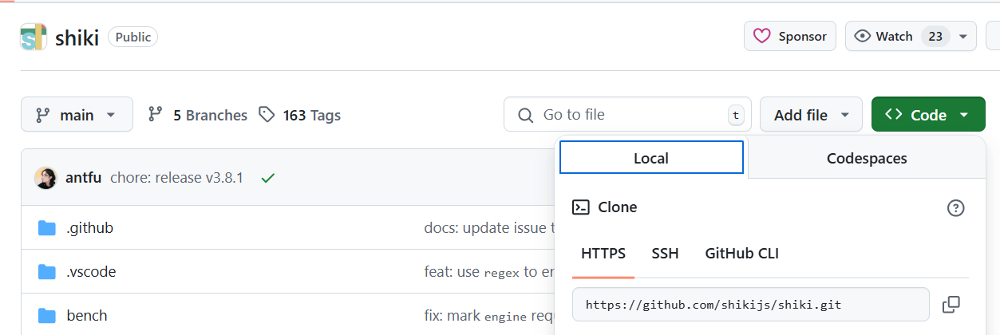

### branch

現在の branch をベースに新しい branch を作成する

- コマンドライン
  - `git branch ブランチ名`
- VSCode
  - 左下のブランチ名押下 > create new branch から作成。
  - 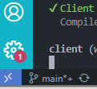
  - 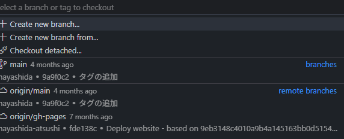
- IntelliJ
  - 画像のブランチ名を押下して、New Branch を押下。
  - 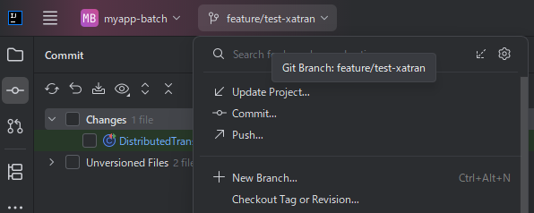

### checkout

現在の branch から別の branch に移動するときに使用する。

- コマンドライン
  - `git checkout 移動先のブランチ名`
- VSCode
  - 左下のブランチ名押下 > 移動先のブランチを選択
  - 
  - 
- IntelliJ
  - 画像のブランチ名を押下して、移動先のブランチを選択。
  - 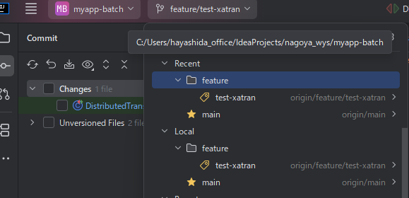

### add

対象のファイルをコミット前のステージングするときに使用する。

- コマンドライン
  - `git add ファイル名`
  - `git add .`で配下のすべてのファイルを add する。
- VSCode
  - 画像の+ボタン
  - 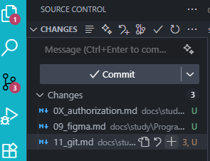
- IntelliJ
  - 基本はファイル作成時に自動で add される。以下は add されていない場合に手動で行う方法。
  - 画像の add したいファイル 右クリック > Git > Add
  - 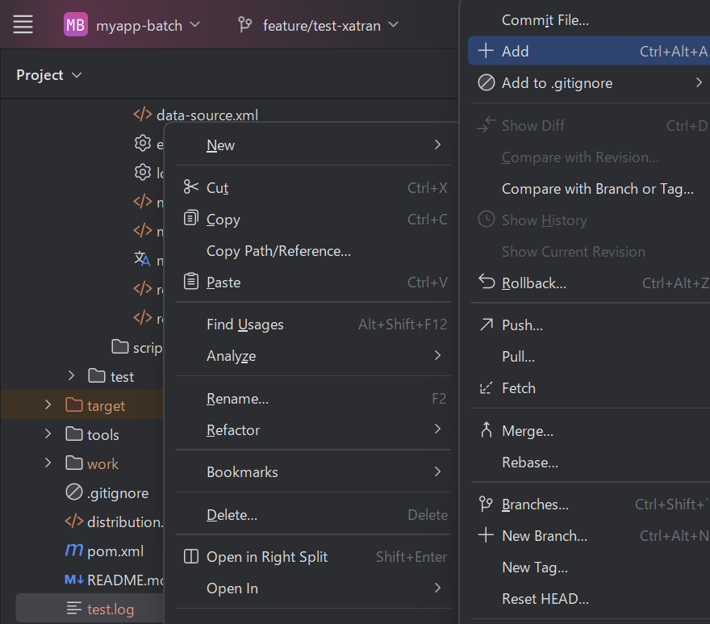

### commit

対象のファイルをコミット(変更を確定)するときに使う。

- コマンドライン
  - `git commit -m "commit message を記載する"`
- VSCode
  - 画像の box に commit message を記載し、commit ボタンを押下。(staged changes のみが commit される)
  - 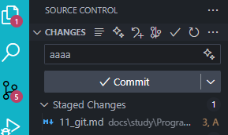
- IntelliJ
  - 画像のように changes に ✅ を入れ、commit message を「メモを追加」の部分に記載し、commit ボタンを押下。
  - 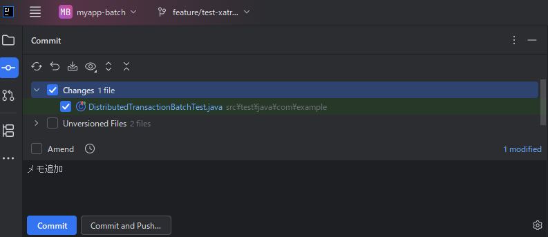

### push

コミットしたファイルをリモートリポジトリに反映させる

:::warning 注意
develop や main などの branch には直接 push しないようにすること。
大体リモートリポジトリ側で防がれているが、基本的には MR や PR を作ってそれをマージしてもらうことで変更を加えるようにすること。
詳細は開発の流れで記載。
:::

- コマンドライン
  - `git push origin リモートブランチ名`
- VSCode
  - 画像の 3 点リーダーから push を押下
  - 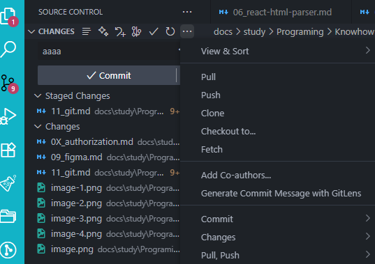
- IntelliJ
  - 画像のブランチ名をクリックして、push を押下
  - 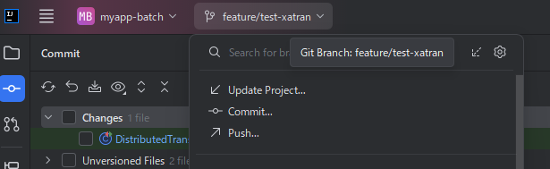

### fetch

リモートブランチの変更をローカルにあるリモート追跡用のブランチに取り込む

- コマンドライン
  - `git fetch`
- VSCode
  - 画像の 3 点リーダーから fetch を押下
  - 
- IntelliJ
  - 画像左上のハンバーガーから git > fetch を押下
  - 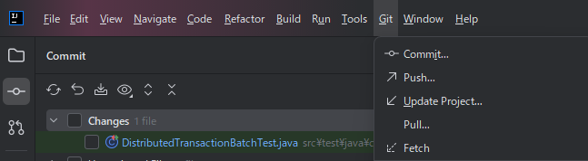

### merge

あるブランチを別のブランチに取り込む

- コマンドライン
  - 取り込み先のブランチで`git merge 取り込み元のブランチ名`
- VSCode
  - `Ctrl+Shift+P`で検索 box を開き git merge と検索して、git merge を押下。取り込みたいブランチを選択する。
  - 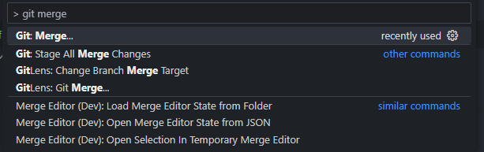
  - 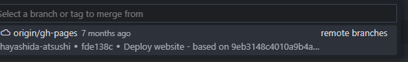
- IntelliJ
  - 画像左上のハンバーガーから git > merge を押下。merge 元のブランチ名を入力して merge を押下。
  - 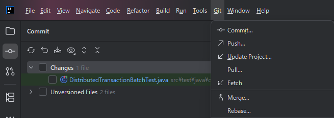
  - 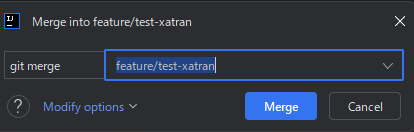

### pull

リモートブランチの変更をローカルブランチに取り込むときに使用。(fetch+merge)

- コマンドライン
  - 該当ブランチで`git pull`
- VSCode
  - 画像の 3 点リーダーから pull を押下
  - 
- IntelliJ
  - 画像左上のハンバーガーから git > pull を押下
  - 

### log

該当ブランチのコミットログを表示する。

- コマンドライン
  - `git log`

### revert

コミットログを指定して、コミットを取り消す。(取り消したコミットログは消えない)

- コマンドライン
  - `git revert コミットログ`

### reset

コミットを取り消す。(取り消したコミットログは消える。参照できなくなる)

- コマンドライン
  - 直前のコミットを取り消す。`git reset --hard HEAD^`

:::warning 注意
よほどのことがない限り使わないようにすること。
:::

## チーム開発の流れ例と作業者がやること

### 具体例

チーム開発をする上で大まかな開発の流れを理解することで、コンフリクトなどやトラブルを防ぐことができる。 
以下はよくある conflict した際のブランチの模式図である。 
feature-A を develop にマージする際に conflict が発生し、大規模修正が必要となったりする。さて、これを防ぐにはどうしたらよいだろうか。

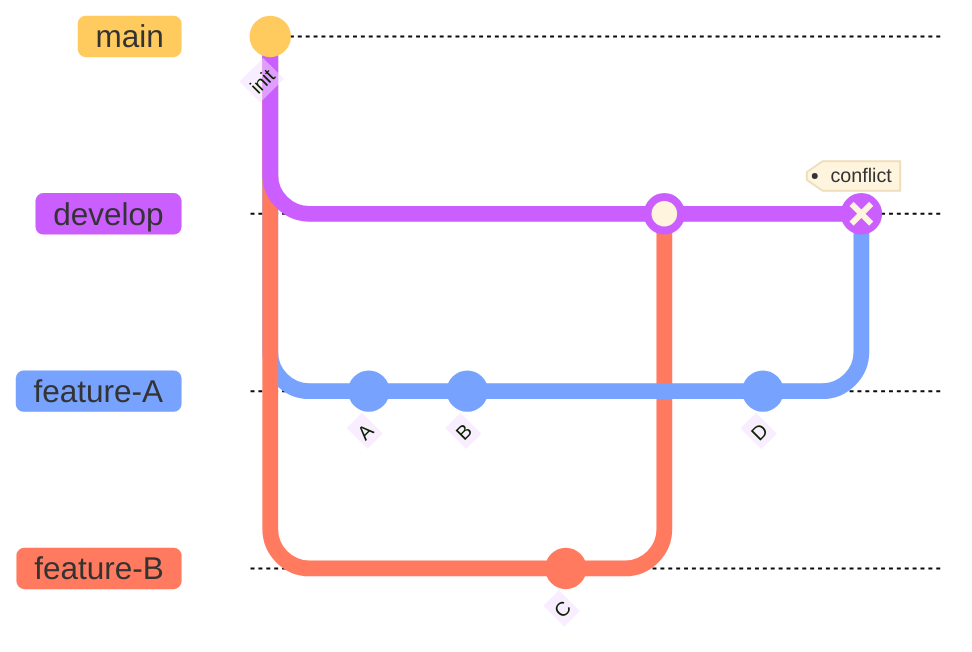

feature-B が develop に merge されたタイミングで feature-A の作業者は以下の作業をしておかなければならない。

1. リモートの develop を pull
2. ローカルの develop をローカルの feature-A に merge(※ここで conflict する可能性はある)
3. commit D を行う。

とすると最低限の conflict の解消で済む。

### 作業者の作業

以上を踏まえて、作業者が定期的に(毎日)やることは以下。

1. 自身が作業しているブランチの切り出し元のブランチを pull する。
2. その切り出し元のブランチを自身の作業ブランチに merge する。
3. 必要に応じて conflict を解消する。
4. 以降は自分の作業を行う

## トラブルシューティング集

### 直前に不要なファイルをコミットしたので取り消したい

個人的には reset か revert で戻すのを推奨。rebase はよくわからなくなることが多い。

- ログを残したい
  - `git log`で最新のコミットログの hash 値を取得
  - `git revert コミットログ`
- ログを残したくない
  - `git reset --hard HEAD^`または`git reset --hard コミットログ`

:::warning 注意
どちらにせよコミットする前の状態(=コミットした内容は消えることに注意。変更箇所が残ったまま add した状態に戻るわけではない)
:::

### 間違えてローカルの develop や main ブランチに commit してしまった

上記と同じように対応すること。ただし、commit ログを残したくないので、reset で行うこと。自信がなければ周りの人に相談しましょう。

### ローカルブランチと push 先のリモートブランチがなぜか異なる

- `git branch -vv`で一旦どこにつながっているのかを確認する(本当に異なるのか)
- `git branch --unset-upstream`で一旦 push 先をリセットする
- 再度 push する。

## 参考

- [shiki.js](https://github.com/shikijs/shiki)
- [Qiita](https://qiita.com/hirokiwa/items/8ba4901a865ccdecb4e8)
