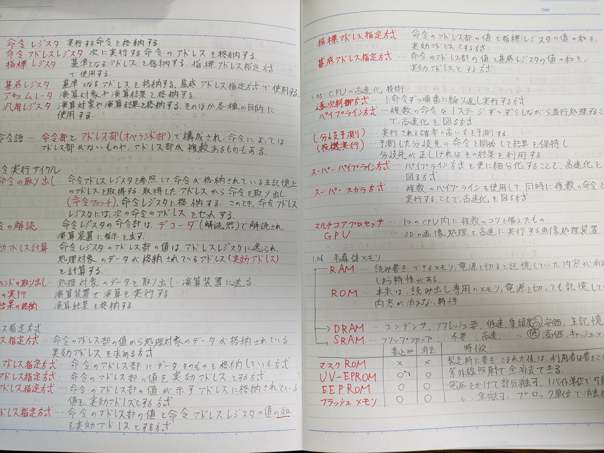

# 基本情報技術者試験🔰

## ざっくり

### ※旧試験(2022年)に受験したときの勉強法です

参考書を読む→過去問を解く、という順番で学習した。 
勉強期間は参考書を読んでる期間が1ヶ月くらい、過去問解いてる期間が1週間くらいだった。 
試験は午前、午後とあるが午前向けの学習をきちんとやっておけば良い。午後は時間配分を考えるために、いくつか過去問を解けばなんとかなった。

## 勉強方法

### 参考書を使った勉強

[栢木先生シリーズ](https://www.amazon.co.jp/%E4%BB%A4%E5%92%8C06%E5%B9%B4-%E3%82%A4%E3%83%A1%E3%83%BC%E3%82%B8%EF%BC%86%E3%82%AF%E3%83%AC%E3%83%90%E3%83%BC%E6%96%B9%E5%BC%8F%E3%81%A7%E3%82%88%E3%81%8F%E3%82%8F%E3%81%8B%E3%82%8B-%E3%81%8B%E3%82%84%E3%81%AE%E3%81%8D%E5%85%88%E7%94%9F%E3%81%AE%E5%9F%BA%E6%9C%AC%E6%83%85%E5%A0%B1%E6%8A%80%E8%A1%93%E8%80%85%E6%95%99%E5%AE%A4-%E6%A0%A2%E6%9C%A8-%E5%8E%9A/dp/4297138271/ref=asc_df_4297138271/?tag=jpgo-22&linkCode=df0&hvadid=676083549242&hvpos=&hvnetw=g&hvrand=7066887864622952220&hvpone=&hvptwo=&hvqmt=&hvdev=c&hvdvcmdl=&hvlocint=&hvlocphy=1028825&hvtargid=pla-2244898042723&psc=1&mcid=a01bc22ee38234d4af0bf48bda083431&th=1&psc=1&gad_source=1)がわかりやすいと聞いたのでこれを使った。 
前から順に読んでいって、わからない単語と意味をひたすらノートに写経した。 

こんな感じ

それでもよくわからないものは、ネットで単語を調べたりした。

### 過去問を使った勉強

[基本情報技術者試験ドットコム](https://www.fe-siken.com/)でひたすら過去問を解いた。 
午前試験に向けては、大体1000問くらい解いて得点率60%位を目指した(解いた量がすべてを解決する、と思っている)。 
間違えた問題に関してはノートに解説を写したり、[参考書を使った勉強](#参考書を使った勉強)で書いたものを見直したりした。  

午後試験は各分野合計で20問くらい解いた。時間配分とか問題の傾向とかを把握するために使った。

**※新試験は過去問非公開らしい**
ので、[基本情報技術者試験ドットコム](https://www.fe-siken.com/)や書籍で売られているであろう、模擬試験を解くのが良いかも...？
